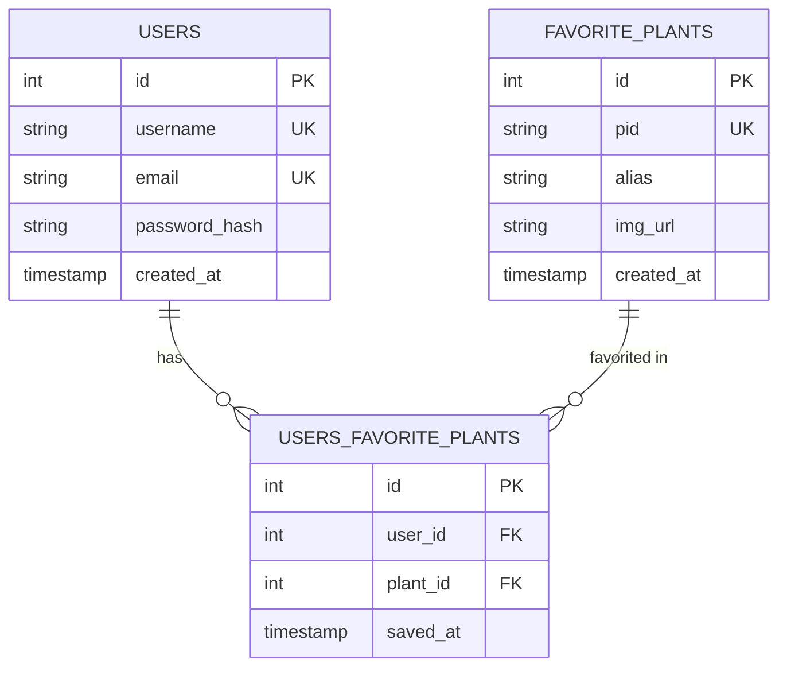

# 🌿 Easy Bloom: Plant Care Guidance App

A full-stack application built by Hiwot, Juliana, Paloma and Shilpa at **Hack Your Future** to help users track and manage their favorite plants with personalized care guidance.

## Table of Contents

- [Team & Roles](#team--roles)
- [Project Overview](#project-overview)
- [Getting Started](#getting-started)
- [API Endpoints](#api-endpoints)
- [API Documentation](#api-documentation)
- [Deployment & Demo Links](#deployment--demo-links)
- [Project Structure](#project-structure)
- [Entity-Relationship Diagram](#entity-relationship-diagram)
- [Key Technical Decisions](#key-technical-decisions)
- [Current Status](#current-status)
- [Development Notes](#development-notes)
- [License](#license)
- [Getting Help](#getting-help)

## Team & Roles

| Person  | Primary focus                                                               |
| ------- | --------------------------------------------------------------------------- |
| Paloma  | Authentication, security (rate limiting), error handling, API documentation |
| Juliana | Database design & schema, frontend                                          |
| Hiwot   | Plants & Favorites API, PlantBook integration                               |
| Shilpa  | User profile API, frontend                                                  |

Mentored by Unmesh.

---

## Project Overview

Easy Bloom is a plant management platform where users can:

- Create an account with secure authentication
- Search and explore plant information via the PlantBook API
- Save favorite plants to their personal collection
- Access personalized plant care tips and guidance

**Tech Stack:**

- **Backend:** Node.js + Express.js
- **Database:** PostgreSQL (with Knex.js migrations)
- **Authentication:** JWT (JSON Web Tokens) with bcrypt password hashing
- **API Documentation:** Swagger/OpenAPI
- **Frontend:** (in progress: templates available)

---

## Getting Started

### Prerequisites

- **Node.js** v20.12.1 or higher
- **npm** v10.5.0 or higher
- **PostgreSQL** running locally or remote connection details

### Installation

1. **Clone the repository:**

   ```bash
   git clone https://github.com/Paloma-Cardozo/GreenMinds.git
   cd GreenMinds/api
   ```

2. **Install dependencies:**

   ```bash
   npm install
   ```

3. **Set up environment variables:**
   - Copy `.env-template` to `.env`
   - Fill in your configuration:

     ```
     PORT=3001
     DB_CLIENT=pg
     DB_HOST=localhost
     DB_PORT=5432
     DB_USER=postgres
     DB_PASSWORD=your_password
     DB_DATABASE_NAME=greenminds
     DB_USE_SSL=false

     JWT_SECRET=your_secret_key_here
     PLANTBOOK_CLIENT_ID=your_client_id
     PLANTBOOK_CLIENT_SECRET=your_client_secret
     ```

4. **Create the database:**
   - Using pgAdmin or your PostgreSQL client, create a database named `greenminds`

5. **Run migrations:**

   ```bash
   npm run migrate:latest
   ```

6. **Seed demo data (optional):**
   ```bash
   npm run seed
   ```
   This creates 4 demo users (hiwot, juliana, paloma, shilpa) with passwords matching their usernames.

### Running the Server

**Development:**

```bash
npm run dev
```

**Production:**

```bash
npm start
```

The API will be available at `http://localhost:3001/api`

### Authentication & Password Requirements

- **Password**: Minimum 8 characters, no spaces allowed
- **Email**: Must be valid email format (validated with regex)
- **JWT Token**: Expires in 7 days
- **Email normalization**: All emails are converted to lowercase at signup/login to prevent duplicate accounts
- **Rate limiting on login**: Maximum 5 failed login attempts per 15 minutes (returns 429 Too Many Requests)

---

## API Endpoints

### Sign up and Login

- **POST** `/api/auth/signup` — Register a new user

  ```json
  {
    "username": "john_doe",
    "email": "john@example.com",
    "password": "secure_password_8+"
  }
  ```

- **POST** `/api/auth/login` — Login and receive JWT token
  ```json
  {
    "email": "john@example.com",
    "password": "secure_password_8+"
  }
  ```
  Returns: `{ token: "jwt_token", user: { id, username, email } }`

### Plants & Favorites

Most endpoints require `Authorization: Bearer <token>` header, except GET /plants/search and GET /plants/options which are public.

- **GET** `/api/plants/favorites` — Get user's favorite plants
- **POST** `/api/plants/favorites` — Add a plant to favorites
  ```json
  {
    "pid": "plantsdb_id",
    "alias": "optional_custom_name"
  }
  ```
- **DELETE** `/api/plants/favorites/:id` — Remove a favorite plant
- **GET** `/api/plants/search?q=query&limit=20` — Search for plants by name
  - Query parameters: `q` (search query, minimum 3 characters), `limit` (optional, default 20, max 50)
  - Returns empty results if query is less than 3 characters
- **GET** `/api/plants/options` — Get list of all available plants in favorites database
  - Returns array of plants sorted alphabetically by alias/pid
  - Each plant object includes: `id`, `pid`, `alias`, `img_url`
  - Does NOT require authentication
- **GET** `/api/plants/care/:pid` — Get detailed care information for a specific plant
  - `:pid` is the PlantBook plant ID
  - Returns care details: sunlight, watering, soil, fertilization, pruning

### User Profile

All endpoints require `Authorization: Bearer <token>` header, and act on the currently logged-in user (there's no way to view or edit another user's profile).

- **GET** `/api/users/me` — Get the logged-in user's profile (`id`, `username`, `email`, `created_at`)
- **PUT** `/api/users/me` — Update the logged-in user's `username` and/or `email`
  ```json
  {
    "username": "new_username",
    "email": "new_email@example.com"
  }
  ```
- **DELETE** `/api/users/me` — Permanently delete the logged-in user's account
- **PUT** `/api/users/me/password` — Change the logged-in user's password
  - Requires current password for verification
  - New password must be at least 8 characters and contain no spaces
  ```json
  {
    "currentPassword": "old_secure_password_8+",
    "newPassword": "new_secure_password_8+"
  }
  ```

---

## API Documentation

Interactive API documentation is available at:

```
http://localhost:3001/api-docs
```

Use the "Authorize" button to test endpoints with your JWT token.

---

## Deployment & Demo Links

| Resource           | Link                                                                                           |
| ------------------ | ---------------------------------------------------------------------------------------------- |
| Deployed API       | [https://greenminds-fe0k.onrender.com/api](https://greenminds-fe0k.onrender.com/api)           |
| Deployed API docs  | [https://greenminds-fe0k.onrender.com/api-docs](https://greenminds-fe0k.onrender.com/api-docs) |
| Deployed Frontend  | [https://easybloom.onrender.com/](https://easybloom.onrender.com/)                             |
| Postman collection | [Easy-Bloom-Auth-API-Collection.json](./Easy-Bloom-Auth-API-Collection.json)                   |

---

## Project Structure

```
GreenMinds/
├── api/                          # Backend
│   ├── src/
│   │   ├── index.mjs            # Express server setup
│   │   ├── database_client.js   # Knex database configuration
│   │   ├── swagger.js           # Swagger/OpenAPI configuration
│   │   ├── middleware/
│   │   │   ├── asyncHandler.js  # Wraps async routes to forward errors automatically
│   │   │   ├── auth.js          # JWT verification
│   │   │   ├── errorHandler.js  # Error handling
│   │   │   ├── loginLimiter.js  # Rate limiting
│   │   │   └── notFoundHandler.js
│   │   ├── routers/
│   │   |   ├── auth.js          # Authentication routes
│   │   |   ├── plants.js        # Plants/favorites routes
│   │   │   └── users.js         # User profile routes
│   │   └── services/
│   │       └── plantService.js  # PlantBook integration and favorites logic
│   ├── migrations/               # Database schema
│   ├── seeds/                    # Demo data
│   ├── .env-template             # Environment variable reference (copy to .env locally)
│   └── package.json
├── app/                          # Frontend (in progress)
├── templates/                    # Frontend starter templates
└── README.md
```

---

## Entity-Relationship Diagram



---

## Key Technical Decisions

A few choices worth explaining, beyond just listing the tech stack:

- **Centralized error handling middleware** — instead of each route formatting its own error responses, all unexpected errors flow through one `errorHandler.js`, so the response format stays consistent and internal error details (database error messages) never leak to the client.
- **`asyncHandler` wrapper for all async routes** — Express 4 doesn't automatically catch errors from `async` routes, so one unhandled rejection could crash the entire server. Wrapping every route in a small reusable function fixes this once, following DRY, instead of relying on every route remembering its own `try/catch`.
- **Rate limiting on login only, not signup** — login is the realistic target for brute-force password guessing; signup doesn't expose that same risk, so it was left unrestricted to avoid blocking legitimate new users.
- **Email normalization (lowercase) at signup and login** — avoids users accidentally creating duplicate accounts, or failing to log in, due to inconsistent capitalization in their email address.
- **PlantBook API on-demand (no local database)** — Instead of bulk-importing plant data at startup, the app queries PlantBook API on every search/care request. This reduces storage but adds dependency on external API availability.

---

## Current Status

### ✅ Completed

- User authentication (signup, login, JWT tokens)
- Password security (bcrypt hashing)
- Plant favorites management (CRUD operations)
- API documentation (Swagger/OpenAPI)
- Rate limiting on login endpoint
- Email validation and normalization
- Bearer token authentication on protected routes
- User profile management (view, update, delete account)

### 🔄 In Progress

- Frontend implementation (choose template: Vanilla JS, React, or Next.js)
- Additional plant features (watering schedule)

### Not Yet Implemented (Optional)

These were listed as optional ideas in the project requirements:

- Automated tests (integration tests for key endpoints)
- CI pipeline (GitHub Actions on each PR)
- Pagination, sorting, and filtering on list endpoints
- Role-based access control (admin vs regular user)

---

## Known Limitations

- **No role-based access control**: All authenticated users have the same permissions; no admin features
- **No pagination on search results**: Plant search returns all matching results (up to API limit of 50)
- **No email verification**: Email addresses are accepted without verification at signup
- **Single-user data access only**: Users can only view and manage their own resources; cannot access other users' data
- **PlantBook API dependency**: App relies entirely on external PlantBook API; no local plant database fallback if API is unavailable
- **Frontend still in template form**: Frontend UI is not yet fully integrated with backend; currently using starter templates

---

## Future Improvements

These features would enhance the app but are outside the current scope:

- **Pagination and filtering**: Add pagination to search results and filtering by plant characteristics
- **Email verification**: Require email confirmation before account activation
- **Role-based access control**: Implement admin roles for moderation and analytics
- **Local plant database caching**: Cache PlantBook data locally for offline functionality and faster searches
- **Advanced plant tracking**: Add watering schedules, growth tracking, and photo logs per plant
- **Mobile app**: Develop native iOS/Android app for on-the-go plant care reminders
- **Social features**: Allow users to share favorite plants and care tips with other users
- **Push notifications**: Send reminders for watering, fertilizing, and seasonal care tasks

---

## Development Notes

### Database Migrations

Migrations are managed with Knex.js. To create a new migration:

```bash
npx knex migrate:make migration_name
```

---

## License

This is a Hack Your Future educational project.

---

## Getting Help

For issues or questions:

1. Check the API documentation at `/api-docs`
2. Review the `.env-template` for required configuration
3. Ensure PostgreSQL is running and accessible
4. Check console logs for error messages

---
