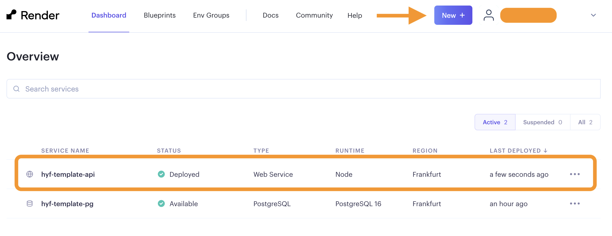
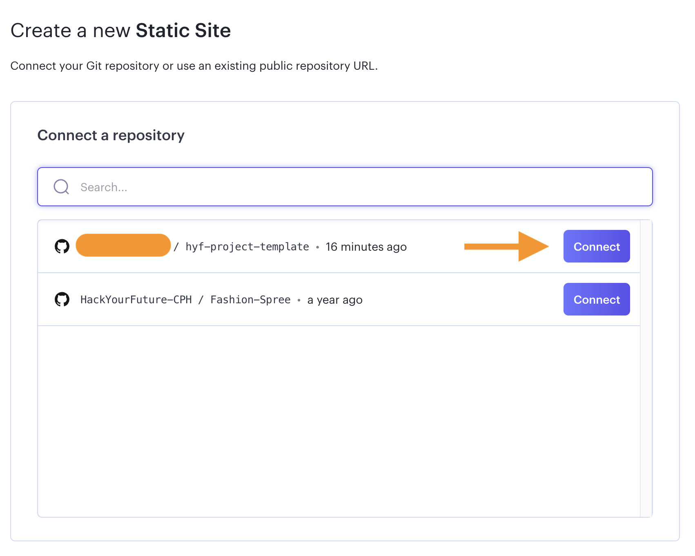
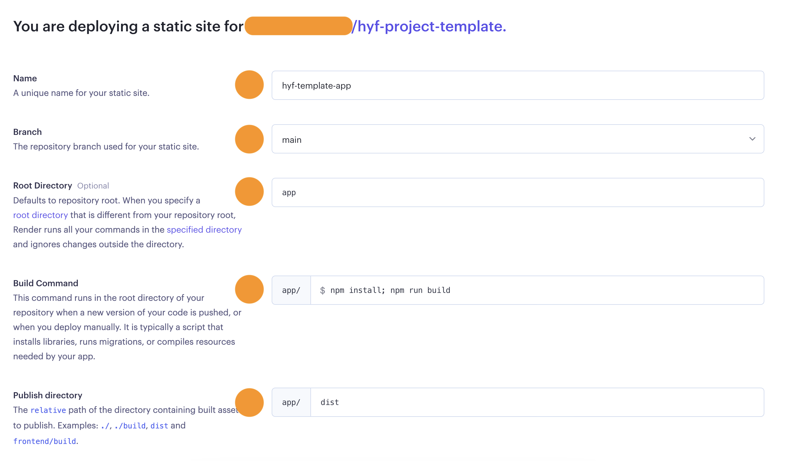
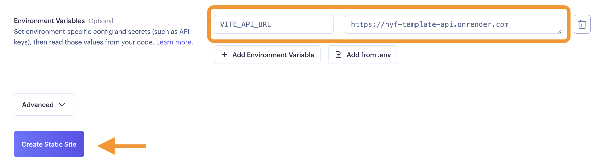
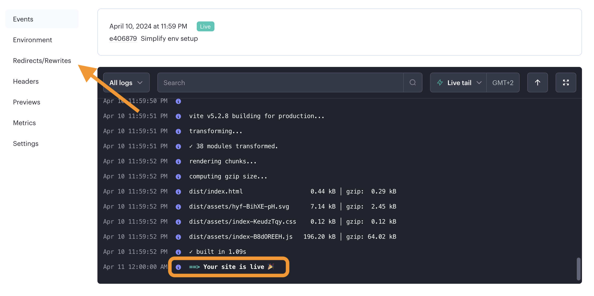
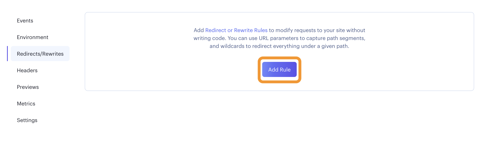

# Frontend: Easy Bloom App

A static Vanilla JavaScript web application for plant care guidance. No build step required, pure HTML, CSS, and JavaScript.

## Table of Contents

- [Local Development](#local-development)
- [Project Structure](#project-structure)
- [Deploying](#deploying)
- [Troubleshooting](#troubleshooting)

---

## Local Development

The frontend is a static Vanilla JavaScript application. You have several options to serve it locally.

### Prerequisites

- A modern web browser (Chrome, Firefox, Safari, Edge)
- One of the following (choose the option that works for you):
  - Python 3 (usually pre-installed on macOS/Linux)
  - Node.js with npm
  - VSCode with Live Server extension

### Option 1: Using Python (simplest, recommended)

No installation needed if you have Python 3:

```bash
cd app
python -m http.server 8000
```

Then visit `http://localhost:8000` in your browser.

To stop the server, press `Ctrl+C` in the terminal.

### Option 2: Using http-server (Node.js)

If you have Node.js installed:

```bash
npm install -g http-server
cd app
http-server
```

Then visit `http://localhost:8080` in your browser.

### Option 3: Using VSCode Live Server (easiest with hot reload)

1. Install the "Live Server" extension in VSCode (search "Live Server" by Ritwick Dey)
2. Right-click on `app/index.html`
3. Select "Open with Live Server"
4. Browser will automatically open at `http://localhost:5500`

Changes to files will auto-reload in the browser.

### Configuring the API URL for Local Development

By default, the frontend connects to the **deployed API** at `https://greenminds-fe0k.onrender.com/api`.

To use your **local API server** during development:

1. Open `app/script.js`
2. **Uncomment line 10:**
   ```javascript
   const API_BASE_URL = "http://localhost:3001/api";
   ```
3. **Comment line 12:**
   ```javascript
   // const API_BASE_URL = "https://greenminds-fe0k.onrender.com/api";
   ```
4. Save the file and refresh your browser

When you're done testing locally and want to use the deployed API again, reverse these steps (comment line 10, uncomment line 12).

### Quick Verification

Visit your local server (`http://localhost:8000`, `http://localhost:8080`, or `http://localhost:5500`) and verify:

- ✅ Landing page loads with hero section and about cards
- ✅ Click "Search Plant" and search for a plant (e.g., "tomato")
- ✅ See search results with plant names and images
- ✅ Click a plant to select it, then "Continue": redirects to login
- ✅ Sign up with valid email and password (8+ characters, no spaces)
- ✅ Login with your credentials
- ✅ See Favorites page, can search and add plants
- ✅ Click on a favorite: see care details (sunlight, watering, soil, etc.)
- ✅ Visit Profile page: can update username/email or change password
- ✅ Logout works and returns to landing page

---

## Project Structure

```
app/
├── index.html          # Landing page (hero, about, plant search)
├── login.html          # Login and signup forms
├── favorites.html      # User's favorite plants collection
├── profile.html        # User profile (edit info, change password)
├── script.js           # All application logic
├── style.css           # All styling (responsive design)
└── README.md           # This file
```

### File Descriptions

| File             | Purpose                                                                 |
| ---------------- | ----------------------------------------------------------------------- |
| `index.html`     | Landing page with hero section, about cards, and plant search interface |
| `login.html`     | Combined login and signup form with toggle between modes                |
| `favorites.html` | Displays user's saved plants with search and delete options             |
| `profile.html`   | User account management (edit profile, change password)                 |
| `script.js`      | Application logic: API calls, form handling, localStorage, navigation   |
| `style.css`      | Responsive styling with flexbox/grid, handles mobile-to-desktop layouts |

---

## Deploying

The frontend is deployed to Render as a **Static Site** (no build step required).

### Step 1: Create a Static Site on Render

1. Go to [render.com](https://render.com) and sign in
2. From your Dashboard, click the **"New +"** button (top right)
3. Select **"Static Site"**



### Step 2: Connect Your Repository

1. On "Create a new Static Site" page, click **"Connect a repository"** section
2. Search for your repository (e.g., `hyf-project-template` or `GreenMinds`)
3. Click **"Connect"**



### Step 3: Configure the Static Site

Fill in the deployment configuration:

| Field                 | Value                                  |
| --------------------- | -------------------------------------- |
| **Name**              | `easy-bloom-app` (or your chosen name) |
| **Branch**            | `main`                                 |
| **Root Directory**    | `app`                                  |
| **Build Command**     | (leave empty)                          |
| **Publish directory** | `app`                                  |



### Step 4: Add Environment Variables (Optional)

This app doesn't strictly require environment variables since the API URL is hardcoded in `script.js`. However, if you want to use an environment variable:

1. In the "Environment Variables" section, add:
   - **Key:** `VITE_API_URL`
   - **Value:** `https://greenminds-fe0k.onrender.com/api` (or your deployed API URL)

Note: This variable won't be used unless you add code to read it in `script.js`.



### Step 5: Create the Static Site

1. Click **"Create Static Site"** button
2. Render will build and deploy your site
3. You'll see build logs appearing



Wait for the message **"Your site is live"** to appear.

### Step 6: Configure Redirect Rules (Important for SPA)

This is **required** for the app to work correctly since it's a Single Page Application:

1. Once your site is live, go to the site settings
2. Click **"Redirects/Rewrites"** in the left menu
3. Add a rule:
   - **Source:** `/*`
   - **Destination:** `/index.html`
   - **Action:** `Rewrite`
4. Click **"Save Changes"**

This ensures that all routes (login, favorites, profile) load `index.html` and let JavaScript handle routing.



### Step 7: Verify Deployment

1. Visit your deployed site URL (e.g., `https://easy-bloom-app.onrender.com/`)
2. Verify:
   - ✅ Landing page loads correctly
   - ✅ Search functionality works
   - ✅ Can navigate to login page
   - ✅ Profile, favorites pages load without 404 errors
   - ✅ API calls reach the backend correctly

### Updating the Deployed Site

Every time you push to the `main` branch on GitHub, Render automatically redeploys your site. No manual action needed.

To deploy manually:

1. Go to your site in Render
2. Click "Manual Deploy" → "Deploy latest commit"

---

## Troubleshooting

### "API calls return 401 or connection errors"

**Check:**

1. Verify the API is running and accessible
2. In `script.js`, ensure `API_BASE_URL` points to the correct server:
   - Local development: `http://localhost:3001/api`
   - Deployed: `https://greenminds-fe0k.onrender.com/api`
3. Check browser console for error messages (`F12` → Console tab)

### "Pages return 404 or show blank screen after navigation"

**Solution:** Make sure the **Redirect Rule** is configured in Render:

- Source: `/*` → Destination: `/index.html` → Action: `Rewrite`

Without this rule, Render tries to serve files directly and can't find routes like `/login` or `/profile`.

### "Styles or images don't load on deployed site"

**Check:**

- All CSS is inline in `style.css` and loaded via `<link rel="stylesheet">`
- All images are referenced by relative paths (e.g., `../images/hyf.svg`)
- No external CDN links (all CSS/JS is self-contained)

### "Live Server shows old cached version"

**Clear cache:**

- Press `Ctrl+Shift+Delete` (Windows) or `Cmd+Shift+Delete` (Mac) to open browser cache settings
- Or use `Ctrl+Shift+R` (Windows) / `Cmd+Shift+R` (Mac) for hard refresh

---

**For API deployment instructions, see [api/README.md](../api/README.md).**
